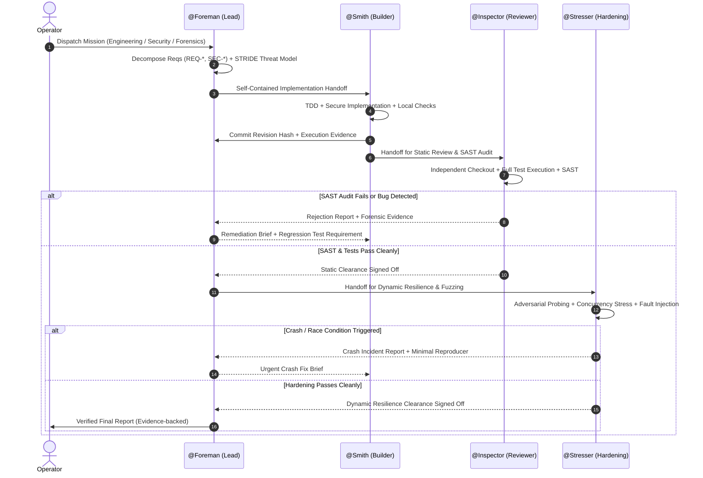

# Dark Factory — Operator Runbook

Step-by-step instructions for operating, monitoring, troubleshooting, and
verifying autonomous multi-agent runs with the Dark Factory.

---

## 1. System Architecture & The Dual-Gate Verification Loop



---

## 2. Environment Preparation

### Directory Setup
Execute commands from the root of the factory repository:

```bash
cd /path/to/factory
```

### Environment Configuration (.env)
Create `.env` with strict `600` permissions (never commit `.env`):

```bash
cp -n .env.example .env
chmod 600 .env
```

Required keys in `.env`:
- `FEATHERLESS_API_KEY`: API key for Featherless AI models.
- `RESULT_REPO`: Absolute path to the target workspace git repository.

### Band Seat Configuration (agent_config.yaml)
Create `agent_config.yaml` with mode `600`:

```bash
cp -n agent_config.example.yaml agent_config.yaml
chmod 600 agent_config.yaml
```

Populate the 4 external seat credentials from Band Desktop:
- `foreman` (Lead Architect)
- `smith` (Full-Stack Builder)
- `inspector` (SAST Reviewer)
- `stresser` (DAST Hardening)

---

## 3. Pre-Flight Diagnostics

Before initiating missions, run automated pre-flight diagnostics:

```bash
./preflight.sh [target-workspace]
```

Checks validated:
- [1/8] System tooling: `git`, `uv`, `opencode`, `band` CLI
- [2/8] Python virtualenv and runtime dependencies
- [3/8] `.env` permissions (600/400) and safe non-evaluating parser
- [4/8] Seat mandates, trust boundaries, and secret hygiene
- [5/8] Featherless API authentication (stdin config) & mandate models in catalog
- [6/8] OpenCode server readiness and authentication
- [7/8] Band agent credentials for all 4 seats
- [8/8] Target workspace git repository readiness

---

## 4. Mission Execution Flow

### Step A: Initialize Target Workspace
```bash
# Bootstrap a fresh, clean target git repository:
./bootstrap-repo.sh "$(pwd)/workspace"

# Or configure an existing repository:
export RESULT_REPO="/absolute/path/to/target/repo"
```

### Step B: Render Mission Dispatch
Select the mission profile template:

```bash
# Profile 1: Full-Stack Engineering & Feature Implementation
./render-dispatch.sh engineering --task "Implement OAuth2 token authentication service"

# Profile 2: Cybersecurity Audit & Hardening (OWASP / SAST / DAST)
./render-dispatch.sh security    --task "Perform OWASP Top 10 security audit and patch vulnerabilities"

# Profile 3: Crash Isolation & Digital Forensics
./render-dispatch.sh forensics   --task "Isolate and fix race condition in task worker queue"
```

The rendered prompt is written to stdout and automatically copied to clipboard if `wl-copy` or `xclip` is installed.

### Step C: Start the Factory Band

#### Host Execution Mode:
```bash
RESULT_REPO="$(pwd)/workspace" ./start-factory.sh
```

#### Sandboxed Container Mode (Recommended for untrusted code):
```bash
RESULT_REPO="$(pwd)/workspace" docker compose -f docker-compose.sandbox.yml up -d
```

`start-factory.sh` will:
1. Validate mandates and verify models against provider catalog.
2. Generate an ephemeral `OPENCODE_SERVER_PASSWORD` for authenticated API calls.
3. Start `opencode serve` with sanitized environment (no API keys in process environment).
4. Launch seats injecting only their respective credentials (`BAND_AGENT_ID`, `BAND_API_KEY`).
5. Run a 15-second survival gate across all seats before accepting missions.
6. Monitor seat processes with sliding-window backoff watchdog and fail-fast termination.

### Step D: Dispatch to Lead Room
1. In Band Desktop, open the room with `@Foreman`.
2. Paste the rendered dispatch message.
3. Observe autonomous dark factory execution:
   - Foreman adds Smith, Inspector, and Stresser to the room.
   - Foreman decomposes work into `REQ-*` / `SEC-*` items and performs STRIDE threat modeling.
   - Smith implements code test-first and commits to `RESULT_REPO`.
   - Inspector independently audits revisions for correctness and OWASP vulnerabilities.
   - Stresser conducts adversarial fuzzing, concurrency stress, and crash reproduction.
   - Foreman delivers the final status report with verifiable revision hashes.

### Step E: Shutdown & Kill Switch
To stop the factory cleanly:

```bash
# Clean graceful shutdown via script:
./stop-factory.sh

# Or trigger immediate mission kill switch:
touch factory.kill
```

---

## 5. Post-Mission Analysis & Forensic Auditing

Export room history from Band Desktop as `room.json`, then run:

```bash
python3 src/analyze_room.py room.json --repo "$RESULT_REPO"
```

Generates:
- Message count, active timestamps, and duration.
- Message distribution across seats and human dispatches.
- Inter-seat mention interaction network.
- Rejection and defect detection events.
- Foreman final report timestamps.
- Git commit distribution and touched directory paths per author.

---

## 6. Troubleshooting & Diagnostics

| Symptom | Root Cause | Solution |
|---|---|---|
| `FEATHERLESS_API_KEY is empty` | Missing key in `.env` | Add key to `.env` and set `chmod 600 .env` |
| `agent_config.yaml missing` | Missing seat config | Copy `agent_config.example.yaml` to `agent_config.yaml` and add credentials |
| `opencode did not become ready in 30s` | Port conflict or crash | Run `./stop-factory.sh`, verify `logs/latest/opencode.log` |
| `seat 'X' died during startup` | Model mismatch or invalid credentials | Check `logs/latest/<seat>.log` for stack trace |
| `Stale git lock detected` | Prior git operation crashed | Remove `.git/index.lock` in the target workspace repo |
| `RESULT_REPO is not a git repository` | Target path not initialized | Run `./bootstrap-repo.sh <path>` first |
| `Mission wall-clock timeout reached` | Run exceeded time ceiling | Check `MISSION_TIMEOUT_S` setting in `.env` or inspect blocker logs |
