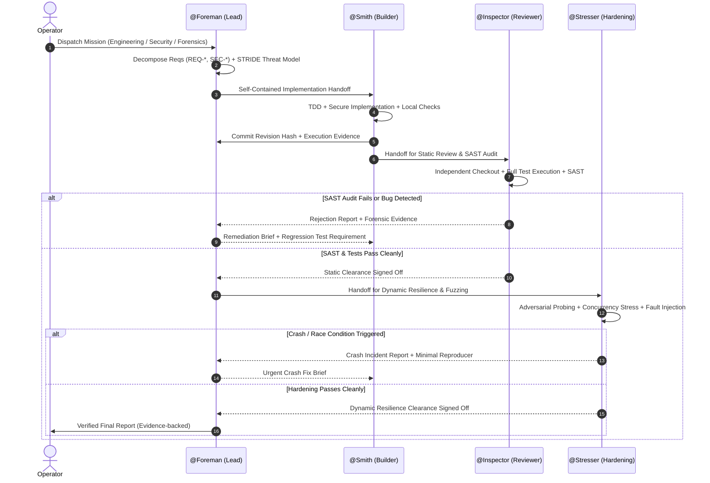

# Dark Factory — Comprehensive Operator & Technical Guide

This guide covers the technical architecture, operating loops, security protocols,
and forensics mechanisms of the Dark Factory system.

---

## 1. System Overview

The Dark Factory orchestrates an autonomous engineering team consisting of four seats:
1. **@Foreman** (Lead Seat / Architect & Cybersec Planner)
2. **@Smith** (Builder / Secure Full-Stack Engineer)
3. **@Inspector** (Reviewer / SAST Auditor & Code Forensics)
4. **@Stresser** (Hardening / DAST Fuzzer & Crash Forensics)

All seats run locally via the Band SDK and connect to OpenCode (`127.0.0.1:4096`),
utilizing high-performance models provided by Featherless AI.

---

## 2. The Verification Loop

---

## 3. Seat Mandates & Capabilities

### @Foreman
- **Harness / Model:** OpenCode / `zai-org/GLM-5.3-Flash`
- **Responsibilities:**
  - Full-scope system architecture and decomposition.
  - Numbered requirement tracking (`REQ-1`, `REQ-2`, ...).
  - Threat modeling using the STRIDE framework.
  - Forensic triage of crashes and vulnerability reports.
  - Autonomous coordination without mid-run human prompts.

### @Smith
- **Harness / Model:** OpenCode / `zai-org/GLM-5.3-Flash`
- **Responsibilities:**
  - Multi-stack software implementation (Python, Go, Rust, TS, C/C++, Shell).
  - Test-Driven Development (TDD).
  - OWASP Top 10 secure coding by design (parameterized queries, input validation, least privilege).
  - Forensic bug remediation: fixes root causes and writes regression tests.
  - Conventional Commits (`git commit -m "feat(...): ..."`) as user "Smith".

### @Inspector
- **Harness / Model:** OpenCode / `MiniMaxAI/MiniMax-M2.5`
- **Responsibilities:**
  - Independent checkouts and test execution (never trusts builder assertions).
  - Static Application Security Testing (SAST): injection flaws, auth bypass, secret leaks, crypto weaknesses.
  - Digital code forensics: traces execution paths, audits commit diffs, uncovers logic flaws.
  - Rejections backed by concrete reproducer commands and line-level diffs.

### @Stresser
- **Harness / Model:** OpenCode / `zai-org/GLM-5.3-Flash`
- **Responsibilities:**
  - Dynamic Application Security Testing (DAST) on local services.
  - Adversarial input fuzzing (overflows, null bytes, malformed JSON, boundary numbers).
  - Concurrency & race condition stress (parallel mutating requests, lock contention).
  - Crash forensics: isolates minimal crashing payloads, records stack dumps, and provides reproducer scripts.

---

## 4. Security & Safety Boundaries

1. **Non-Destructive Local Scope:** Dynamic probing and fuzzing are strictly confined to local test sandboxes and localhost services. External networks are never probed.
2. **Zero Secret Leakage:** Mandates, logs, and git history are audited to ensure credentials (`.env`, `agent_config.yaml`, private keys) are never exposed.
3. **Dual-Gate Verification:** Work is accepted only when both Inspector (static) and Stresser (dynamic) verify compliance.
