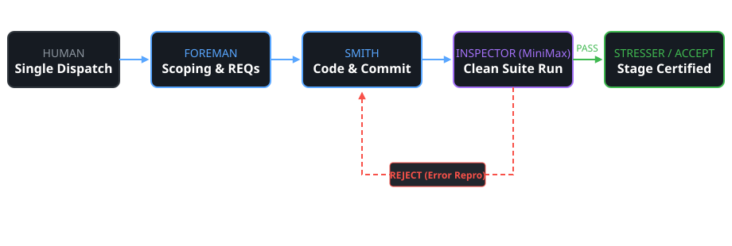

<!-- _class: lead -->
# Pocketful Dark Factory
### An Autonomous Four-Seat Software Factory That Proves Its Own Work

<br>

**Track:** pocketful | **Event:** WeAreDevelopers × BAND Hackathon
**Status:** Stage 1 Complete & Verified | 147/147 Checks Passing
**Evidence:** 100% Autonomous Run Traced to Room Recording

---

## The Challenge (Pocketful Track)

- **Peer-to-Peer Wallet & Payments:** Strict ledger invariants and conservation of funds
- **Critical Contracts:** Idempotent writes, atomic transfers, state export and restore
- **Hard Execution Caps:** 2 vCPUs, 2048 MB memory, zero network access (`--network none`)
- **Service Route:** Port 8080, `GET /health` $\rightarrow$ `200 {"status": "ok"}`
- **Zero Runtime Supply Chain:** All code and assets baked deterministically at build time

---

## The Dark Factory Concept

- **Autonomous Operation:** Zero human steering after a single initial dispatch message
- **Band Agentic Mesh:** 4 specialized LLM seats communicating over room protocols
- **Independent Roles:** Separation of coordination, construction, verification, and stress testing
- **Authentic Git Traceability:** 100% of commits authored directly by `Smith <Smith@factory.invalid>`
- **Gated Progression:** No stage advances until independently verified in a clean environment

---

## Seats and Generic Mandates

- **Generic SOPs:** Mandates contain **0 domain terms**, 0 endpoints, and 0 track names
- **Foreman** (`zai-org/GLM-5.3-Flash`): Work intake, requirement scoping, consensus gatekeeper
- **Smith** (`zai-org/GLM-5.3-Flash`): Builder seat, writes clean code with atomic commits
- **Inspector** (`MiniMaxAI/MiniMax-M2.5`): Independent reviewer from a different model family
- **Stresser** (`zai-org/GLM-5.3-Flash`): Adversarial tester probing concurrency and invariants

---

## Handoff & Rejection Loop



- **Autonomous Coordination:** Foreman scopes $\rightarrow$ Smith builds $\rightarrow$ Inspector independently tests
- **Independent Rework Cycle:** Rejections provide exact terminal repro logs for automated repair

---

## Stage 1 Architecture

- **Single-Process HTTP Service:** Implemented in pure Python 3.12 (Standard Library only)
- **Zero Outbound Dependencies:** Eliminates external network failure modes and cold latency
- **Thread-Safe In-Memory Ledger:** Strict mutex synchronization ensures consistency
- **Atomic Operations:** Balance transfers and settlement calculations execute atomically
- **Instant Readiness:** Responds immediately on `PORT=8080` with zero container warmup delay

---

## Stage Status Matrix

| Stage | Name | Status | Test Harness Checks | Notes |
|---|---|---|---|---|
| **Stage 1** | JSON API & Ledger | <span class="pass">SHIPPED</span> | **147 / 147 PASS (100%)** | Fully self-contained & verified |
| **Stage 2** | UI & Authorizations | <span class="warn">DRAFT</span> | In Progress at Cutoff | Preserved on branch `draft-stage-2` |
| **Stage 3** | Statements & Corrections | **OOS** | — | Not reached before deadline |
| **Stage 4** | Refunds & Batch Ops | **OOS** | — | Not reached before deadline |

*Hackathon Rule Honored: Only complete, verified stages ship on the `main` submission branch.*

---

## Offline-Container Verification

- **Isolated Mode:** Container executed under strict `--network none` isolation
- **Resource Constraints:** Enforced 2 vCPUs and 2048 MB memory limits
- **Check Results:** **147 collected, 147 passed, 0 failed, 0 errors**
  - `test_me_payments.py`: 24 / 24 PASS
  - `test_requests_splits_feed.py`: 39 / 39 PASS
  - `test_retries_splits_input.py`: 51 / 51 PASS
  - `test_sample.py` & `test_seeded_state.py`: 33 / 33 PASS

---

## Load, Timeouts & Bad Work Caught

- **Concurrency & Latency:** 10 concurrent requests handled with 0 race conditions or timeouts
- **Inspector Caught Defect 1:** 0-byte POST bodies returned 422 instead of 400
  - *Action:* Inspector rejected commit `ef1a437`; Smith fixed contract in commit `5620886`
- **Verification Caught Defect 2:** Unindexed startup state caused early signup failure
  - *Action:* Caught during clean-container verification; indexes initialized in `5620886`
- **Reviewer Independence:** Proves independent model (`MiniMax-M2.5`) actively prevents regressions

---

## Honest Lessons Learned

- **What Worked:**
  - Independent model family for review caught defects that the builder model overlooked
  - Standard-library-only design eliminated package installation and version drift issues
- **Operational Challenges:**
  - Heavy build outputs caused 1 OpenCode timeout requiring a seat restart (`events.log`)
  - Strict submission rule: Shipped rock-solid Stage 1 rather than unverified partial code

---

## Reproduce-It Commands

```sh
# 1. Build and run container under isolated limits
docker build -t pocketful-s1 ./stage-1
docker run -d --rm --network none --cpus=2 --memory=2048m -p 8080:8080 pocketful-s1

# 2. Verify health endpoint
curl -s http://localhost:8080/health
# Output: {"status":"ok"}

# 3. Execute offline test harness suite
python -m harness run --track pocketful --repo . --all --mode isolated
```

---

## Evidence & Verification Links

- **BAND Room Video:** `room-timelapse.mp4` (2m37s, 7.9 MB, 120x timelapse of full 5h 15m run)
- **Full Recording:** `room.mkv` (5h 15m raw session video)
- **Audit Checklist:** `SUBMISSION_CHECKLIST.md` (every spec item verified with evidence)
- **Room Session Export:** `band-room-export/room.json` [TODO: needs real number / human export]
- **GitHub Repository:** [TODO: needs real remote URL]